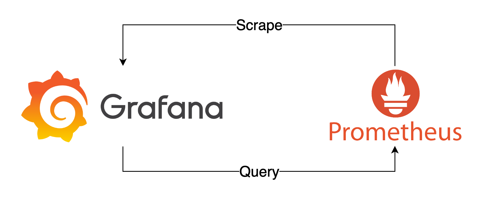

# Grafana



## Quick Start

1. 啟動所有服務

    ```bash
    docker-compose up -d
    ```

2. 檢視服務
   1. Grafana: [http://localhost:3000](http://localhost:3000)，登入帳號密碼為 `admin/admin`
      1. 點擊左上 Menu > Dashboards > Grafana Stats，即可看到透過 Provisioning 建立的 Dashboard
3. 關閉所有服務

    ```bash
    docker-compose down
    ```

## Goals

1. 建立 Grafana
2. 將 Grafana 的資料掛載（Mount）至本機，確保資料不會因 Container 關閉而遺失
3. 使用 Provisioning 的方式建立 Data Source、Dashboard
4. 視覺化呈現 Prometheus Data Source 的資料於 Dashboard
5. 透過 `grafan.ini` 啟用 Grafana 本身的 metrics 功能，以 Prometheus Metrics 的格式Grafana 自身的 Metrics，揭露於 [http://localhost:3000/metrics](http://localhost:3000/metrics)

## Tasks

<details><summary>Task 1: 匯入 Dashboard <a href="https://grafana.com/grafana/dashboards/3662-prometheus-2-0-overview/">Prometheus 2.0 Overview</a></summary>

1. 點擊左上 Menu > Dashboards 點擊右上區域的 New，選擇 Import
2. 使用 `Import via grafana.com` 的方式匯入 Dashboard，Dashboard ID 為 `3662`，點擊 Load
3. prometheus Data Source 選擇 `Prometheus`
4. 檢視 Dashboard，可以看到 Prometheus 的 Metrics 資料

</details>

<details><summary>Task 2: 瀏覽目前的 Data Source 設定以及查詢內容</summary>

1. 點擊左上 Menu > Configuration > Data Sources，可以看到目前的 Data Source 設定
2. 點擊左上 Menu > Explore，可以透過左上的下拉選單選擇 Data Source，下方的查詢區塊會自動帶入該 Data Source 的查詢語法

</details>

## 參考資料

1. [Grafana Internals](https://grafana.com/grafana/dashboards/3590-grafana-internals/)
