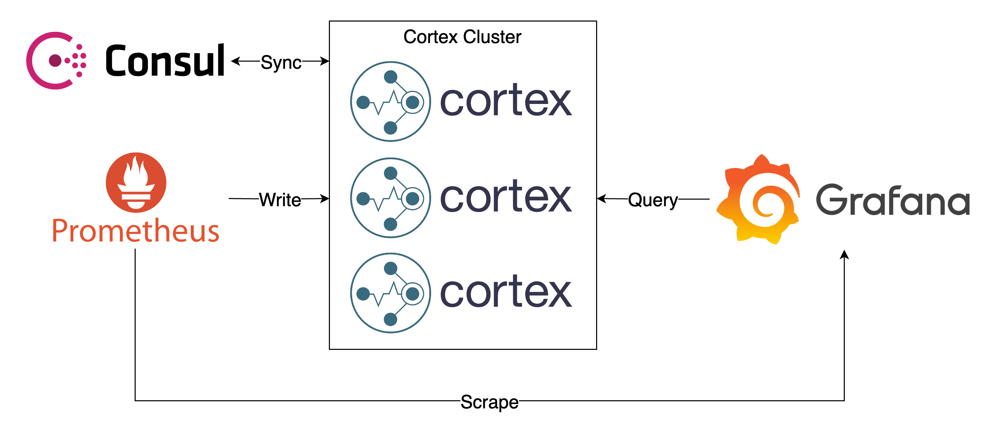

# Cortex

## Single Cortex Instance


### Quick Start

1. 啟動所有服務

    ```bash
    docker-compose up -d
    ```

2. 檢視服務
   1. Prometheus: [http://localhost:9090](http://localhost:9090)
   2. Grafana: [http://localhost:3000](http://localhost:3000)，登入帳號密碼為 `admin/admin`
      1. 點擊左上 Menu > Dashboards > Grafana Stats，即可看到透過 Provisioning 建立的 Dashboard
3. 關閉所有服務

    ```bash
    docker-compose down
    ```

## Multi Cortex Instances



### Quick Start

1. 啟動所有服務

    ```bash
    docker-compose up -d -f docker-compose.multi.yml
    ```

2. 檢視服務
   1. Prometheus: [http://localhost:9090](http://localhost:9090)
   2. Grafana: [http://localhost:3000](http://localhost:3000)，登入帳號密碼為 `admin/admin`
      1. 點擊左上 Menu > Dashboards > Grafana Stats，即可看到透過 Provisioning 建立的 Dashboard
4. 關閉所有服務

    ```bash
    docker-compose down -f docker-compose.multi.yml
    ```

## Goals

1. 建立 Cortex，供 Grafana 查詢與 Prometheus 寫入
   1. Single Instance: 使用 docker-compose.yml
   2. Multi Instances: 使用 docker-compose.multi.yml
      1. Multi Instances 需要額外的 Key-Value Store 同步多個 Cortex，這裡使用 [Consul](https://developer.hashicorp.com/consul)
2. 建立 Prometheus 透過 remote write 的方式將資料寫入 Cortex
3. Grafana 使用 Cortex 當作 Prometheus Data Source

## 參考資料

1. [Cortex Documentation: Getting Started](https://cortexmetrics.io/docs/getting-started/)
