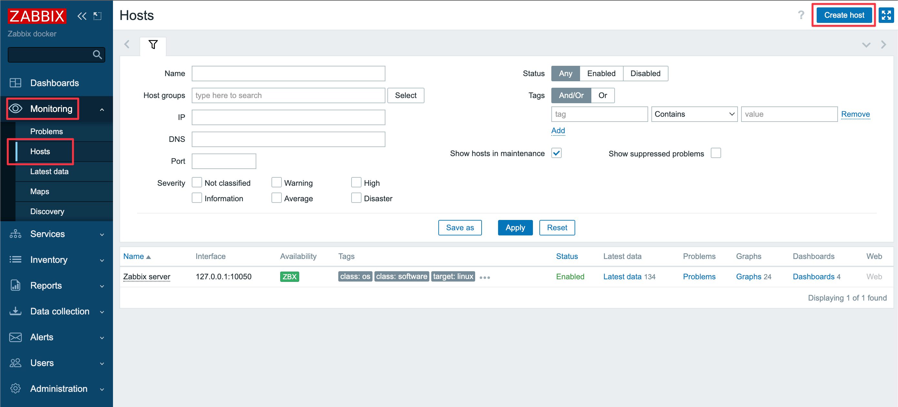
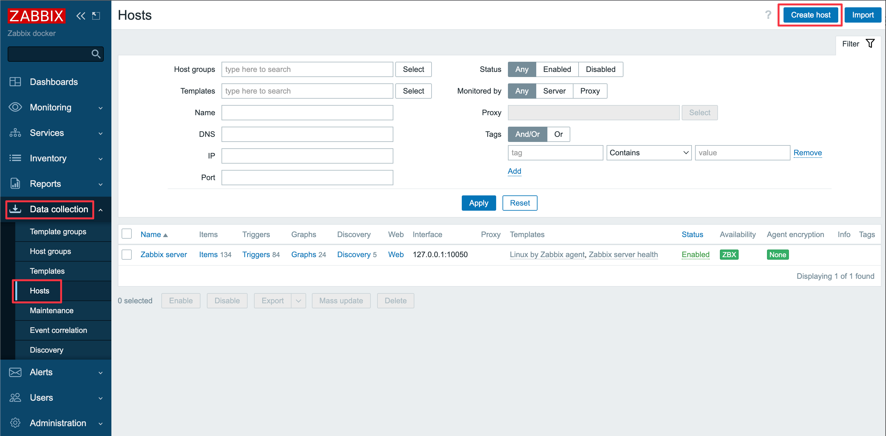
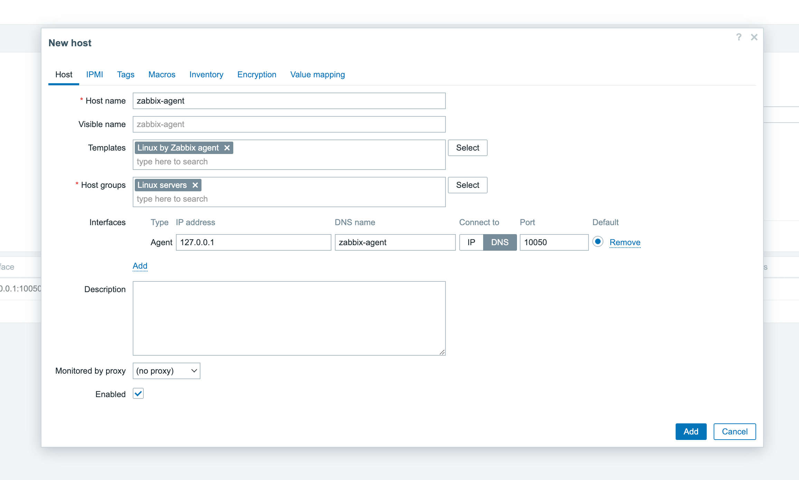
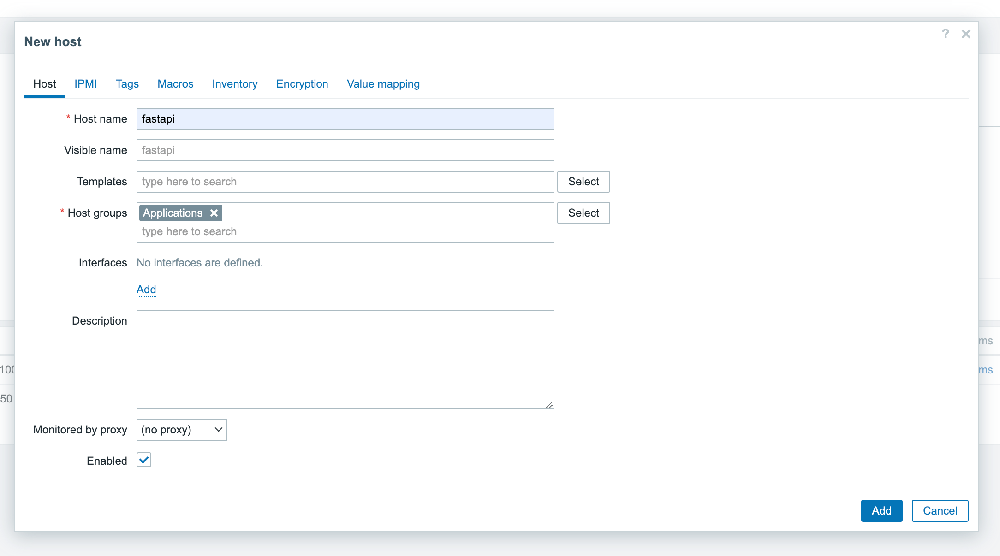
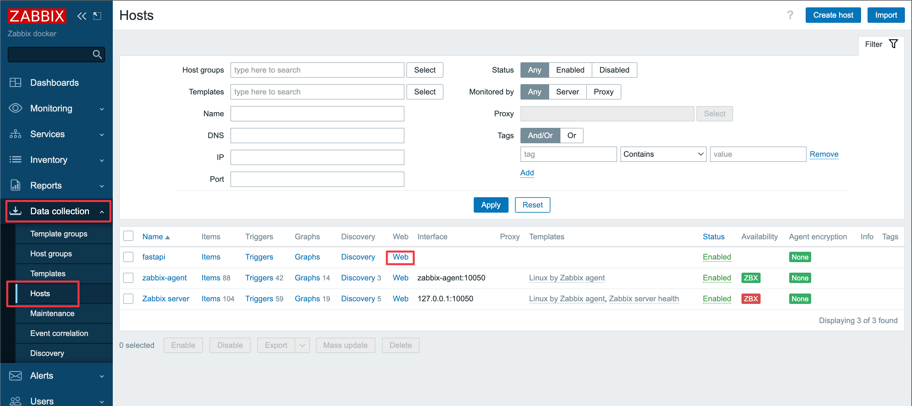
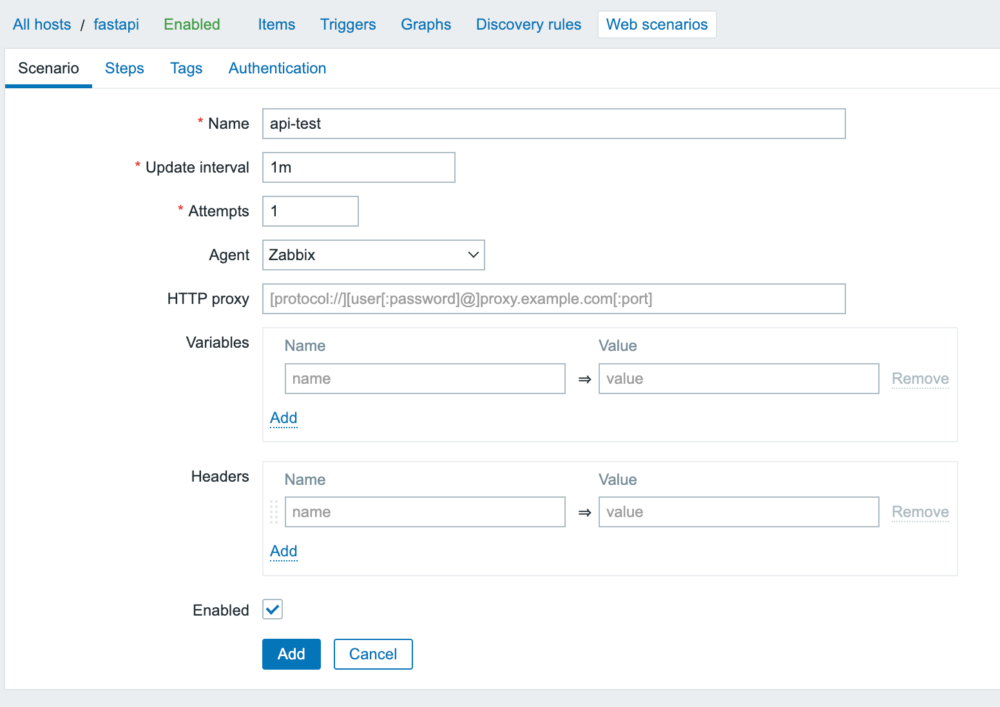
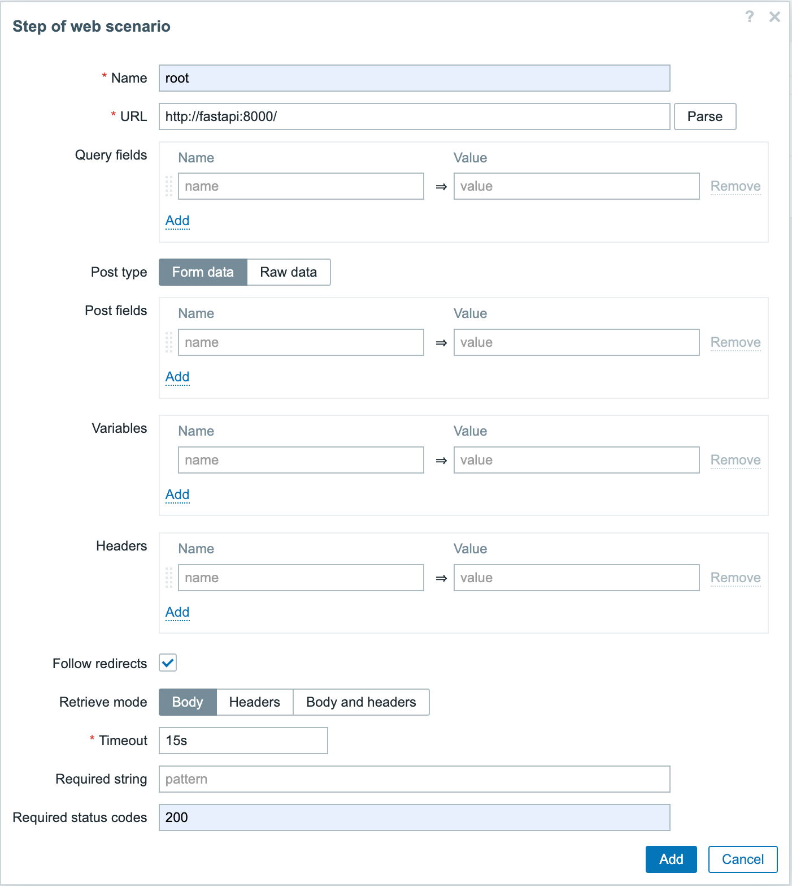
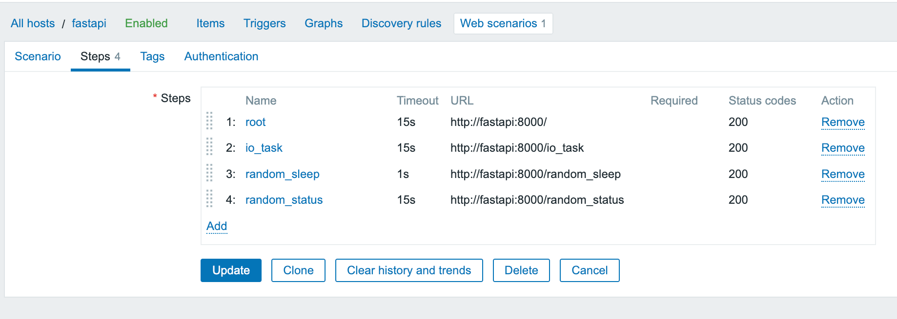
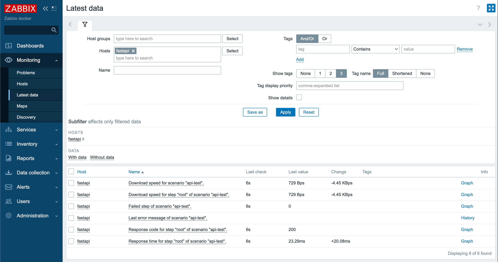

# Zabbix


## Quick Start

1. 啟動所有服務

    ```bash
    docker-compose up -d
    ```

2. 前置設定
   1. 進入 Zabbix Server Container 啟動 Zabbix Agent

        ```bash
        docker exec -it -u root zabbix-server-mysql /bin/bash
        service zabbix-agent start
        CTRL + D # 離開 Container
        ```

   2. 進入 Grafana Container 安裝 [Zabbix Data Source Plugin](https://grafana.com/grafana/plugins/alexanderzobnin-zabbix-app/)
      1. 安裝 Zapix Data Source Plugin

            ```bash
            docker exec -it grafana /bin/bash
            grafana cli plugins install alexanderzobnin-zabbix-app
            CTRL + D # 離開 Container
            ```

       2. 重新啟動 Grafana 讓 Plugin 生效
    
            ```bash
            docker-compose restart grafana
            ```
3. 檢視服務
   1. FlaskAPI: [http://localhost:8000](http://localhost:8000)
   2. Zabbix: [http://localhost](http://localhost)，登入帳號密碼為 `Admin/zabbix`，如果出現 DB 相關的錯誤訊息，請等待一段時間
   3. Grafana: [http://localhost:3000](http://localhost:3000)，登入帳號密碼為 `admin/admin`
      1. 點擊左上 Menu > Explore > Zabbix，即可看到 Zabbix Data Source 的資料
         1. 若已新增其他 Host 且確定有收到資料，但 Group 只有看到 `Zabbix servers`，需至 Data Source > Zabbix 點擊最最下面的 `Save & Test`，更新快取後即可看到其他 Group
      2. 點擊左上 Menu > Dashboards > Zabbix - Full Server Status，即可看到透過 Provisioning 建立的 Dashboard
4. 參考「新增監控項目」章節，建立新的監控項目
5. 關閉所有服務

    ```bash
    docker-compose down
    ```

## Goals

1. 建立 Zabbix 完整服務，Zabbix Server 使用的 Image 為增加 Zabbix Agent 的版本，模擬實際可以正常監控 Zabbix Server 的狀態
2. 建立 Zabbix Agent Container，並連接至 Zabbix Server，模擬監控 Linux Server
3. 建立 FastAPI，於 Zabbix Server 使用 Web Scenario 監控服務
4. 使用 Grafana 連接 Zabbix Data Source

## 新增監控項目

### Zabbix Agent

1. 於左側 Monitoring 選單的 Hosts 頁籤中或左側 Data Collection 選單的 Hosts 頁籤中，點擊右上的 Create host 按鈕
   
   

2. 新增 zabbix-agent Host，如圖設定 Host name、Templates、Host groups，Interfaces 必須設定使用 DNS 並輸入 DNS name 為 `zabbix-agent`，其他預設即可
   

3. 設定完成後稍待一下，可於 Monitoring 選單的 Hosts 頁籤中看到 zabbix-agent 的 `Availability` 狀態 ICON 會變為綠色，表示 Zabbix Server 已經和 Zabbix Agent 連接成功
   

### FastAPI Web Scenario

1. 於左側 Monitoring 選單的 Hosts 頁籤中或左側 Data Collection 選單的 Hosts 頁籤中，點擊右上的 Create host 按鈕

2. 新增 fastapi Host，Host groups 選擇 Application，其他預設即可
   

3. 於左側 Data Collection 選單的 Hosts 頁籤中，點擊 fastapi Host 的 Web
   

4. 點擊右上的 Create web scenario 按鈕，新增 Web Scenario
   

5. 設定 Web Scenario 的基礎設定，如圖設定 Name，其他預設即可
   

6. 進入 Step 頁籤，點擊 Add
   

7. 設定 Step 的基礎設定，如圖設定 Name、URL、Required status codes，其他預設即可
   

8. 可再新增其他 Step，如圖所示，新增完點擊 Add 或 Update 儲存
   

9. 設定完成後稍待一下，可於 Monitoring 選單的 Hosts 頁籤中至 fastapi 的 Latest data 查看執行 Web Scenario 所收集的數據
   
   

## 參考資料

1. [Zabbix - Full Server Status](https://grafana.com/grafana/dashboards/5363-zabbix-full-server-status/)
