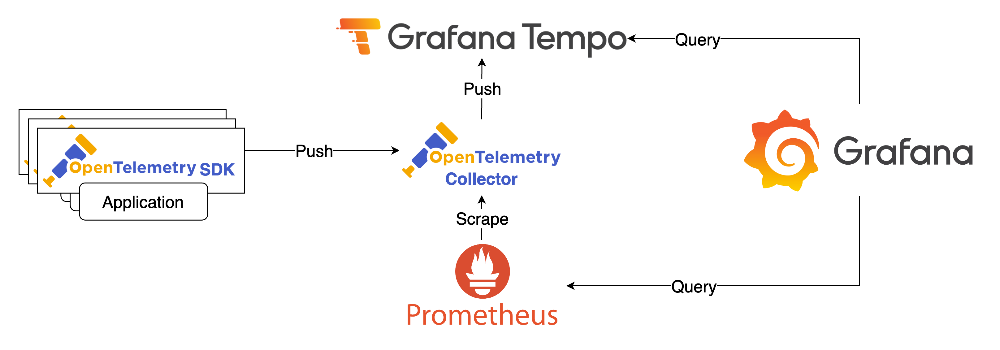

# OpenTelemetry Collector



## Quick Start

1. 啟動所有服務

    ```bash
    docker-compose up -d
    ```

2. 檢視服務
   1. FastAPI App
      1. app-a: [http://localhost:8000](http://localhost:8000)
      2. app-b: [http://localhost:8001](http://localhost:8001)
      3. app-c: [http://localhost:8002](http://localhost:8002)
   2. Grafana: [http://localhost:3000](http://localhost:3000)，登入帳號密碼為 `admin/admin`
      1. 點擊左上 Menu > Explore，左上 Data Source 選擇 `Tempo`，即可看到 Traces 資料
      2. 透過瀏覽器對 application 的 `/chain` 發送 Request，可以在 Trace 資訊中看到 `app-a`、`app-b`、`app-c` 互相呼叫的順序
         1. app-a: [http://localhost:8000/chain](http://localhost:8000/chain)
         2. app-b: [http://localhost:8001/chain](http://localhost:8001/chain)
         3. app-c: [http://localhost:8002/chain](http://localhost:8002/chain)
      3. 或是使用 [k6](https://k6.io/) 發送 Request

            ```bash
            k6 run --vus 1 --duration 300s k6-script.js
            ```
   
   3. Prometheus: [http://localhost:9090](http://localhost:9090)
      1. 搜尋 `{job="otel-collector"}` ，可以看到 OpenTelemetry Collector 揭露的 Metrics

3. 關閉所有服務

    ```bash
    docker-compose down
    ```

## Goals

1. 建立 FastAPI App（app-a、app-b、app-c），透過 OpenTelemetry Zero-code Instrumentation 產生與收集 Traces，並發送至 OpenTelemetry Collector
2. 建立 OpenTelemetry Collector
   1. 接收 Traces 資料，經過處理後發送至 Tempo
   2. 揭露 OpenTelemetry Collector 的 Metrics 在 8888 port，供 Prometheus 收集
3. 建立 Tempo，接收 Traces 資料
4. 建立 Prometheus，收集 OpenTelemetry Collector 的 Metrics
5. 建立 Grafana，查詢 Tempo 顯示 Traces 資料

## 參考資料

1. [FastAPI with Observability](https://github.com/blueswen/fastapi-observability)
2. [Spring Boot with Observability](https://github.com/blueswen/spring-boot-observability)
3. [Tempo Local Example](https://github.com/grafana/tempo/tree/main/example/docker-compose/local)
